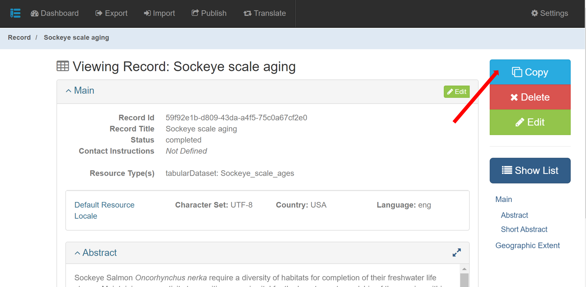

# Copy Records

The **Copy** button is located in the mdEditor action menu on the right-hand side of the screen when viewing the summary screen of the record. The Copy Button allows you to make a duplicate of an existing metadata record.

**Making a copy of a record can be used to**:

* Start a new product, project, or contact record.
* Populate multiple products faster (e.g., multiple workshop reports, a poster based on a publication).
* Create a "template record" for a project that can be used as a starting place for each full metadata record. A template record can contain information commonly used across your projects or products (such as contacts).

**Use the Copy button carefully**:

Making a copy will generate a new Record ID for the copied record and be named “Copy of …”. All the other info will remain the same **including associations**. The “Metadata Identifier” is NOT copied but any other identifiers in the [Main Citation](../../project-entry-guidance/main-tab/#citation) section of the metadata record you copied **WILL be** copied.


It is extremely important to review all copied identifiers and delete any that do not apply to the new record. Leaving in identifiers that do not belong could result in your new item being published to the wrong location.


Before saving, carefully review all information in a copied record to ensure all copied info is still relevant to the copied record, particularly any identifiers.
