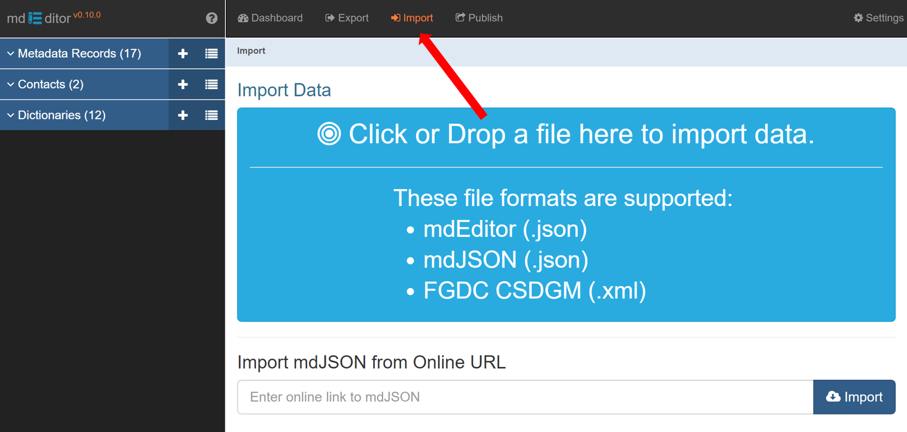

# Import Records

The Import function loads an mdEditor or mdJSON file into the current mdEditor session. You can also import existing ScienceBase metadata or FGDC (Federal Geographic Data Committee) metadata into mdEditor to create mdJSON.

1. Click and navigate to the file or drag and drop a file onto the **Import Data** button to import a local file.
2. Review the selected information. If there is more than one copy of the same metadata record or contact, use the "preview JSON" button to choose the record or contact with the most complete information.
3. Select the records you want to import. Typically, you will want to import all.&#x20;
4. Check that the Replace/Merge toggle is set to **Replace**.&#x20;
5. Click on the right hand button “**Click to Import Data.**”

## Replace vs. Merge 

.PNG>)

The **Replace/Merge** toggle allows you to either replace or merge the imported records with the records currently loaded in mdEditor.&#x20;


Always set the Replace/Merge toggle to **Replace**.&#x20;

