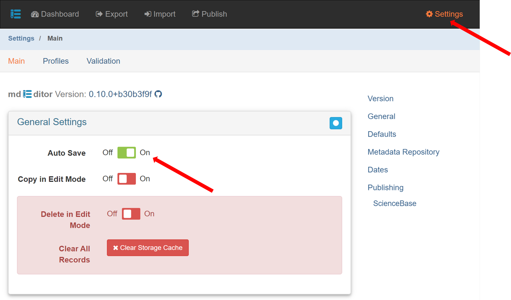

# A Workflow At A Glance

## Step 1: Gather the information needed for your metadata entries

Have information about your projects and products on hand before. This information may be present in proposals, protocols, or funding documents.  Information needed includes start and end dates, project abstracts or product summaries, contacts, QA/QC procedures or other protocol documents.&#x20;

If you are writing metadata for a product, tidy your data products using the best practices guidance provided in the [AK-Region Interim Data Management User Guide](https://ak-region-dst.gitbook.io/alaska-region-interim-data-management-user-guide/).&#x20;

## Step 2: Open mdEditor and check Settings

The direct link to mdEditor is [https://go.mdeditor.org](https://go.mdeditor.org/). Bookmark this link in your browser for future reference.

The first time you open mdEditor, check your settings. Consider changing the AutoSave to ON. The AutoSave option will write all changes to local storage as soon as you exit a data entry field. Changes must be manually saved if the Auto-Save feature is turned off. AutoSave allows you to save less frequently, but it makes it harder to undo your changes. Once you leave the record, the record is saved and changes can no longer be cancelled.

## Step 3: (If necessary) import the metadata file from your project's archive folder

If you are updating an existing metadata record, you will need to import the mdEditor JSON file from the project's folder in the Regional Data Repository. Learn how to import files into mdEditor on the [Import ](../alaska-region-tools/mdeditor-basics/import.md)page.&#x20;

The metadata file will either be in the incoming folder or the metadata folder in your project's archive folder. It will still be in the incoming folder if it has not been approved by your Data Custodian. It will be in the metadata folder if your Data Custodian has already reviewed and approved it.&#x20;


If you are starting a new project metadata file, skip to step 4.&#x20;


## Step 4: Import a Contacts Master file the Regional Data Repository, if needed.

Learn how to import files into mdEditor on the [Import ](../alaska-region-tools/mdeditor-basics/import.md)page.&#x20;

Contacts need to be loaded into mdEditor before they can be used in the creation of metadata records. Your data managers maintain a contacts master file ready for import into mdEditor.  It can be found in the 'contacts' folder in the top level directory of the [Regional Data Repository](../alaska-region-tools/ak-region-data-repository.md) titled with "AKContactsmdeditor-datetime.json"   Consult the [contacts](../contact-entry-guidance/) section for information on the contact record and adding new contacts.

## Step 5: Consider making a template record and using the Copy Record function

If you are creating a project record with many product records with similar information, consider making a template metadata record that includes all the similar information and then can be duplicated with the [Copy Record](../alaska-region-tools/mdeditor-basics/copy-records.md) function to avoid repeated entering of the same information.&#x20;


If you do copy a record, thoroughly review the copied record to be sure that all information in relevant to the new record.&#x20;


## Step 6: Write (or revise or update) metadata

Follow [project entry guidance](../project-entry-guidance/), [product entry guidance](../product-entry-guidance/) or [dictionary entry guidance](../dictionary-entry-guidance/) depending on what type of metadata you are writing.&#x20;

## Step 7: Create Associations

Associations link project metadata with product metadata. With both the project and product metadata loaded into mdEditor, associations can be established [from the project to the product](../project-entry-guidance/associated-tab.md) or [from the product to the project](../product-entry-guidance/associated-tab.md).&#x20;

## Step 8 : Export the metadata file to your project's incoming folder for review and backup

[Export](../alaska-region-tools/mdeditor-basics/export.md) the project, product, and data dictionary records as a single file to the incoming folder in the project's archive folder on the Regional Data Repository using **Export All**.  Rename this file "project\_name.json." For example, MBMWA\_011\_YKDNestPlot.json would be the metadata record for the YK Delta nest plot survey project conducted by the Waterfowl Program in MBM (it was the 11th project archive record created by the program).&#x20;


Even if your metadata file is not ready for review, export it to the incoming folder after every session and import it back into mdEditor at the beginning of a new session. It serves as a backup to your metadata files.


This metadata file will be moved from your incoming folder to the metadata folder of the project by the data custodian after review.

## Step 9: Data Custodian reviews metadata and product

The Data Custodian may ask you to revise the metadata and you would import the metadata from the incoming folder to continue working on it (see Step 4). When the metadata file is approved, the Data Custodian will move the metadata file and associated products from the incoming folder and into the appropriate location(s) in the archive folder.

