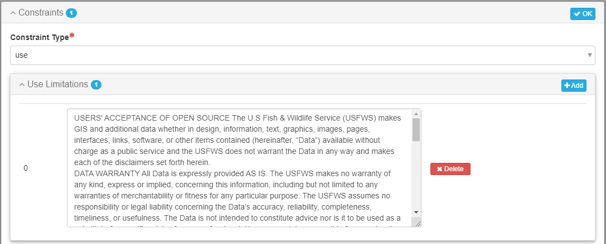

# Product Constraints Tab

**The Constraint** tab allows you to enter information into the metadata about how the resource can and cannot be used, license, and security classification information.

In the majority of cases, Service data is open and free for public use.  While the lack of constraint metadata indicates free and open access and unrestricted use, there is value in adding constraint information.  Some example text inserts are provided below.

## Use Constraint 

Identify concerns over how people should or should not use the product.&#x20;

The text in the above use constraint generally states that the data is AS IS, without warranty, including a liability disclaimer, and no authority act clause (see language below).

USERS' ACCEPTANCE OF OPEN SOURCE The U.S Fish & Wildlife Service (USFWS) makes GIS and additional data whether in design, information, text, graphics, images, pages, interfaces, links, software, or other items contained (hereinafter, “Data”) available without charge as a public service and the USFWS does not warrant the Data in any way and makes each of the disclaimers set forth herein. DATA WARRANTY All Data is expressly provided AS IS. The USFWS makes no warranty of any kind, express or implied, concerning this information, including but not limited to any warranties of merchantability or fitness for any particular purpose. The USFWS assumes no responsibility or legal liability concerning the Data’s accuracy, reliability, completeness, timeliness, or usefulness. The Data is not intended to constitute advice nor is it to be used as a substitute for specific advice from a professional. Users are solely responsible for ensuring the accuracy, currency and other qualities of any products derived from or in connection with the Data. The Data is collected from various sources, and may be modified over time without notice to improve spatial and attribute accuracy. The USFWS disclaims responsibility for the spatial accuracy and attribution of GIS features and makes no warranty concerning it. LIABILITY DISCLAIMER The USFWS disclaims any responsibility or legal liability to users for damages of any kind, including lost profits, lost savings or any other incidental or consequential damages relating to the providing of the Data or the use of it. The USFWS expressly disclaims any responsibility to defend or indemnify users against claims of others based on users’ copying, reliance, distribution, or other use of any of the Data. Users assume the risk of using this Data and shall have no remedy at law or equity against the USFWS in case the Data provided is inaccurate, incomplete or otherwise defective in any way or applied in such a manner. NO AUTHORITY TO ACT Users are not authorized by USFWS to combine this Data with other data with the intent or effect of representing a USFWS business function such as, but not limited to, matters relating to land development, permitting, or other evaluation. When using this Data, a user has no authority to represent its products or services as though user were a USFWS agent or office. Maps or applications using this Data may not include the USFWS logo, USFWS seal, or any text or other content suggesting they are a direct product of the USFWS. Data citations are permitted. DATA CURRENCY This Data may be updated at irregular intervals. All users should check for updates regularly and ensure the most current version of the Data is being used. TERMINATION OF DATA AVAILABILITY The USFWS reserves the right to modify the Data in any way or discontinue providing any or all of the Data at any time without notice and is not liable for any modification, suspension, or discontinuation of access to the Data. Additionally, USFWS may require the termination of any and all display, distribution, or other use of any or all of the Data for any reason. RELIABILITY OF OPEN DATA SITE The USFWS does not maintain and is not responsible for the performance or reliability of third party distribution website. The vendor may change the functionality or temporarily suspend the site for maintenance without notice. Performance and reliability are solely the responsibility of the vendor.

### **FWS Approved Terms of Use Statement for AGOL** 

Open geospatial data served on ArcGIS Online (AGOL) should include the following terms of use statement as a use contraint.  For further information on AGOL, see the FWS Geospatial Services Information Sharepoint page '[Getting Started with FWS ArcGIS Online'](https://doimspp.sharepoint.com/sites/fws-gis/SitePages/ArcGIS-Online.aspx#getting-started-in-fws-arcgis-online)

The below standard language is recommended (copy and paste):\
\
​​​​​​​The United States Fish and Wildlife Service (Service) shall not be held liable for improper or incorrect use of the data described and/or contained herein. While the Service makes every reasonable effort to ensure the accuracy and completeness of data provided for distribution, it may not have the necessary accuracy or completeness required for every possible intended use. The Service recommends that data users consult the associated metadata record to understand the quality and possible limitations of the data. The Service creates metadata records in accordance with the standards endorsed by the Federal Geographic Data Committee.

As a result of the above considerations, the Service gives no warranty, expressed or implied, as to the accuracy, reliability, or completeness of the data. It is the responsibility of the data user to use the data in a manner consistent with the limitations of geospatial data in general and these data in particular. Although these data have been processed successfully on a computer system at the Service, no warranty, expressed or implied, is made regarding the utility of the data on another system or for general or scientific purposes, nor shall the act of distribution constitute any such warranty. This applies to the use of the data both alone and in aggregate with other data and information.

## Legal Constraint 

Legal constraints include license and classification information.  In most cases, Service data is open access and the creative commons license applies.

**For open access data**, the legal access constraint should be 'licenseUnrestricted'.

The legal Use Constraint should be 'unrestricted'.  Data are are not open access may be classified as restricted.

Other restraints text box can contain the url for a license.

Data and content created by government employees within the scope of their employment are not subject to domestic copyright protection under [17 U.S.C. § 105](http://www.copyright.gov/title17/92chap1.html#105). Government works are by default in the U.S. Public Domain. If no other open license applies, the following URL should be used in the license field.

[http://www.usa.gov/publicdomain/label/1.0/](http://www.usa.gov/publicdomain/label/1.0/)

The default U.S. Public Domain status of U.S. Government Works is limited to the jurisdiction of the United States. A public domain status is applicable internationally for works produced by government employees, by using a worldwide public domain dedication such as [Creative Commons Zero](https://creativecommons.org/publicdomain/zero/1.0/). This assures users of U.S. Government Works that they have full permission to freely use the work internationally. When Creative Commons Zero has been applied, the following URL should be used for in the license.

.png>)

For more information on Open Data Commons or Creative Commons license, CCO 1.0, which denotes that an item is public domain, or CC BY 4.0, which allows the public to use and redistribute data, but requires that credit be given to the creator, see [Open Data Commons](https://opendatacommons.org/index.html) and [Creative Common](https://creativecommons.org/) to determine if one of these licenses is more applicable.


Unlimited international creative commons license



Unlimited international creative commons license with attribution and change notice requirement&#x20;


## Security Constraint 

Again for open access data, there is not a security constraint and the security classification chosen should be 'unclassified'. &#x20;

.png>)


**If you data is restricted or limited**, consult with your data manager who can work with you and records or FOIA staff to populate the constraints metadata.

