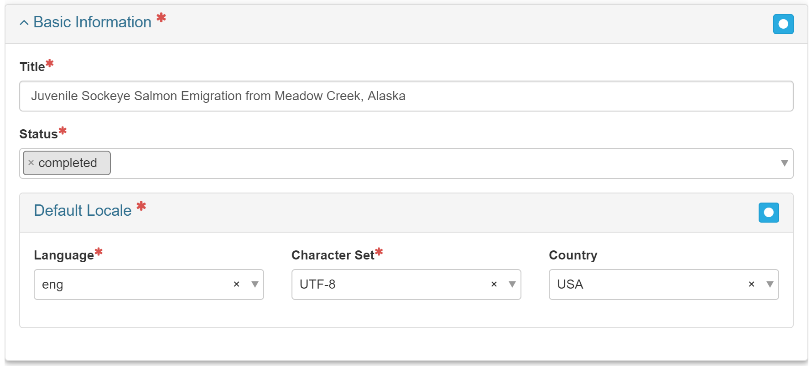

# Product Main Tab

The **Main** tab allows for the creation and/or editing of primary [metadata](https://cookmt.gitbooks.io/mdeditor-for-lccs/content/GLOSSARY.html#metadata) field for a product.

## Basic Information

### Record ID

Record ID will be auto-generated. It can be edited, but it should only done so if absolutely necessary and ideally edited as soon as the record is created in mdEditor.&#x20;


It's a good practice when coping a metadata record to confirm that mdEditor created a new Record ID for the copy.  The record Id is viewable in the 'Copy' screen, 'View' screen or in  the 'Edit' full profile screen.


### Title (Required)

Enter a concise, yet informative title. Good titles, when they appear in a search, will be informative and understandable.  Consider adding location, species, season, survey type or method, and dates.  For example: Japanese Mutant Ninja Turtle Nest Locations in North Bay, Japan 1985-1991

### Status (Required)

The **Status** drop-down menu allows you to select the status of your project. Choose status ONLY from the four following options: _completed, ongoing, proposed, or accepted._

## Default Locale (Required, auto-generated)

**Default Locale** allows for the selection of **Language**, **Character Set**, and **Country**. English, UTF-8, and USA will be selected by default, but you may change them if necessary. See [Settings](https://app.gitbook.com/s/-MW-Wv1z7-vUYrz5cHwE/settings) for instruction.

.png>)

## Resource Types 

The Resource Type should be automatically filled in with the resource type you selected when you created your record.  Select the appropriate resource type.  Name is optional - you can leave this blank or enter your shorten resource name.


Products must have a specific resource type selected; "product" is not an acceptable option.


For definitions and use example of resource types:  see Resource Types Defined page.

## Point of Contacts

Adding a point of contact gives users information on who to contact should they have a question regarding your project. To add contacts to a metadata record, you must first create/upload the contacts into mdEditor. See the Contact Section for more information.


A Master contacts list is maintained in the top level 'contacts' folder of the RDR.  This is maintained by the Alaska program managers and contains staff contacts and common organizational contacts. Before starting and editing metadata records in mdEditor, import the mdJSON contacts file.

If you need to add a contact to this master list, please contact your data manager.&#x20;



Only the first entry in the list of Responsible Parties (#0) will appear in data.gov for those products sent to data.gov.


| Role                  | Description                                                       | Required?     |
| --------------------- | ----------------------------------------------------------------- | ------------- |
| pointOfContact        | Data Steward                                                      | Required      |
| principalInvestigator | The Project PI or Project Manager                                 | Best Practice |
| custodian             | Data Custodian (often a data manager)                             | Required      |
| owner                 | Data Trustee                                                      | Required      |
| originator            | person who collected the data                                     | Required      |
| administrator         | FWS Region +/- FWS Program or unit                                | Best Practice |
| contributor           | partnership organizations and/or other Service program or regions | Best Practice |


In case where the project includes external investigators, use 'coPrincipalInvestigator' for these contacts.


.png>)

**NOTE:**  **Migratory Bird Management** can also include the subprogram as an administrator contact.  These options include: Migratory Birds and State Programs, Eagle Raptor Management Program, Shorebird Program, Waterfowl Program, Seabirds Program, and Land Bird Program.

## Citation 

The **Citation** describes pertinent information about your project such as: responsible parties, identifiers, and any online resources that may be used to reference your project.  The citation much like a peer-reviewed publication citation, provides credit and serves as a reference citation.  Adding information in the citation will also improve users' ability to find your project metadata.

### Citation Required Fields 

#### Title (Required) 

The title of your record is stored in the citation tab.

#### Alternate Title 

You can add an alternate title if desired - generally these should be shorter than the full Title.

#### Dates (Required) 

At least one date is required for projects.  The date type may be the 'start', 'creation', or 'lastUpdate' date.  If a 'start' date is used, an 'end' date should be included in the final metadata record. Ongoing projects may have 'lastUpdate' dates. This exact calendar date associated with the date type may vary from the date of a proposal to the date that funding was approved, or date that the project work began.

#### Responsible Parties (Required) 

At least one responsible party must be assigned in the citation section.  A best practice is to include contacts and their roles who should be recognized for their contribution to the project.  This section is very much like a citation for a peer-reviewed publication.  The identified responsible party will likely be the principal investigator of the project, but may optionally include others like the Project Manager, co-principal investigators, data producers, and contributors, or even administrative organizations like your region and program.


To add contacts to a metadata record, you must first create/upload the contacts in mdEditor. See the [Contacts](https://app.gitbook.com/s/-MW-Wv1z7-vUYrz5cHwE/contacts) section for more information.&#x20;

Note that the Alaska region maintains a master contacts list for staff use that is housed in a top level 'contacts' folder in the [RDR](broken-reference). Your program may also maintain a programmatic master contact file. This is derived from a subset of the regional contact file.  Check with your program data manager.


| Role                  | Description                                         | Required?     |
| --------------------- | --------------------------------------------------- | ------------- |
| pointOfContact        | The main contact for the product, often the PI      | Required      |
| principalInvestigator | project PI                                          | Best Practice |
| administrator         | FWS Region +/- FWS Program or unit                  | Best Practice |
| contributor           | partnership organizations and/or other FWS programs | Best Practice |


Q: Why do I have to put the pointOfContact in two locations?&#x20;

A: Different applications that read metadata look in different places for point of contact information. Placing point of contact in these two locations ensures that it will be "picked up" by all applications.


#### Online Resource (Best Practice) 

Enter the Name and URL for the project homepage website, if available. &#x20;

#### Identifier 

Products can also be assigned a[ Digital Object Identifier](broken-reference) (DOI).  If the project has a DOI, then locating the project will link to the data.  However, some dataset may be stand alone enities in themselves and can have a unique DOI assigned.  This should be entered in the citation identifiers.  If you have other internal IDs the product, enter them here as well.&#x20;

## Description  

**Description** section contains fields including the Abstract, **** Short Abstract, Purpose, and Supplemental Information.

### Abstract (Required) 

Enter an abstract that succinctly describes the project's purpose and goals. Include key species or habitats types, as applicable.

### Short Abstract 

Enter a short description, limited to 300 characters, if desired.  Best practice is a public outreach abstract for pubic affairs purposes.

### Purpose 

Enter a short narrative about the purpose of the project such as the issue or problem that the project is designed to address and anticipated results or benefits. This aligns with SA Internal Tracking metadata.

### Supplemental Information 

Enter comments, if desired.

## Time Period (Required) 

**Time Period** refers to project start and end date. This set of dates is distinct from the fiscal year of funding. The start date indicates the overall project start.  Ongoing projects may not have end dates.  'End date' should be added when the project is completed.  This exact calendar date associated with the date type may vary from the date of a proposal to the date that funding was approved, or date that the project work began.

.PNG>)

### Maintenance

Maintenance refers to the frequency in which the product is revised, updated, modified, or added to.  The default option is 'asNeeded'.  For ongoing projects, 'annually' may be more appropriate.&#x20;
