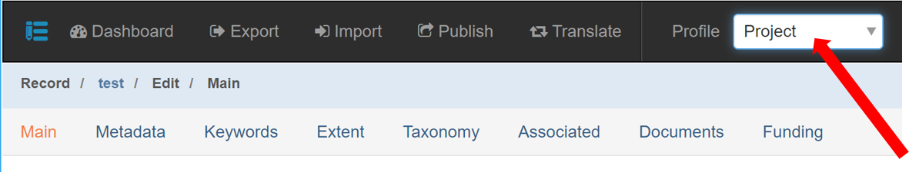

# Project Metadata Guidance

The Project Entry Guidance section will cover how to create a metadata record for a science project.

## Before You Begin

### **Adjust your mdEditor** [**S**](broken-reference)[**ettings**](broken-reference)**:**

**Metadata Repositories**: Make sure your default settings are correct. See Settings.

### **Select the Project Profile**:

After creating your project record initially and before you begin adding metadata, select **Project** from the **Profile** drop-down in the main menu. This will limit the number of available tabs and only show tabs that contain fields that are applicable to project metadata.  Alternatively, some regions or programs have profiles that can be imported into mdEditor.  See Settings for how to do this. &#x20;

### **Select the Project Profile**: 

After creating your project record and before you begin adding metadata, select **Project** from the **Profile** drop-down in the main menu. This will limit the number of tabs listed along the top of the screen, only showing tabs that contain fields that are applicable to project metadata.&#x20;


Having duplicate copies of the same contact is not desirable. It can create confusion as you edit and manage your metadata records and introduce unnecessary errors.


To reduce unnecessary duplication of contacts, Alaska region has a master seed contacts list that include government agencies and partners that are often affiliated with USFWS projects and products. This file is located in the top directory of the Regional Data Repository.&#x20;

In mdEditor, contacts are created separately from science metadata records and then stored in mdEditor. Once contacts have been entered or imported into mdEditor, they can be used in any metadata records.

### **Update your contacts in mdEditor:**

If your contacts are not already loaded into mdEditor, import your program's contacts file from the Regional Data Repository. Please contact your Data Custodian if a new contact needs to be added to the program contacts file or [create a new contact](../contact-entry-guidance/) and submit the record to your Data Custodian for review and inclusion in the program's contacts file. Once contacts have been imported into mdEditor, they can be used in many metadata records.


You should only use contacts in the program's contacts file and avoid creating new contacts yourself. Having duplicate copies of the same contact is not desirable.&#x20;


### Complete the Project Metadata Record 

1. Import or create your project record (see [workflow](../creating-metadata/the-process-at-a-glance.md)).
2. Pick "project" as the **Resource Type**
3. Select the Project Profile: from the Main Menu (Top Navigation Bar) select "**Project"** from the profile drop-down menu.
4. Fill out metadata information for the following tabs:
   * Main Tab
   * Metadata Tab
   * Keywords Tab
   * Taxonomy Tab
   * Extent Tab
   * Documents Tab
   * Funding Tab
5. If applicable, associate your project with other metadata records.
