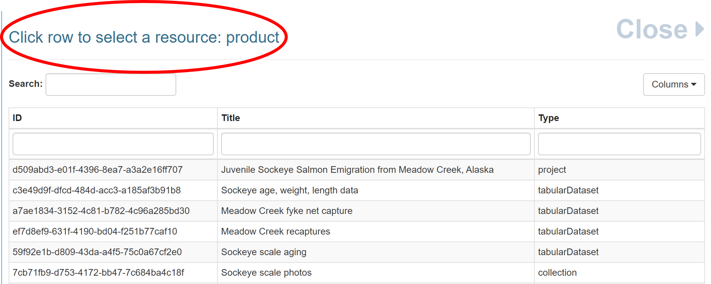
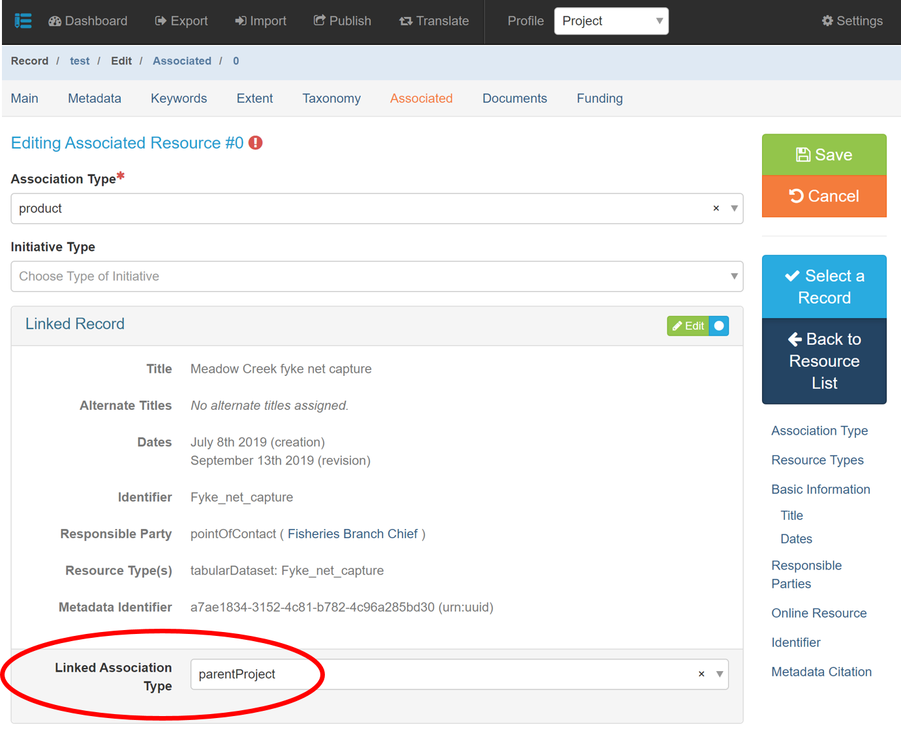

# Project Associated Tab

### Associations (Required, if applicable)

The **Associated** section is used to connect metadata records with each other.  This feature should be used when items are related.  For example, a project metadata record should include associations with its data product metadata record(s) or a project may have a sub-project associated with it.  Projects and data products are required to be linked together with an association where applicable.  Adding associations enables users to find related items more easily and improves discoverability of your work.

## Create Associations

In mdEditor, associations can be created from the Project record or the Product record. The "Association Type" will define the association from your current record to the linked record. Specifying the "Linked Association Type" will create the association from the other direction.


It is more efficient to create associations from the project metadata record after the metadata records are all created.


### Step-by-Step: Creating an Association in a Project Record

**Step 1**: Select "**product"** from the **Association Type** drop-down menu. This field will describe the relationship from the associated record to the project record (the associated record is the product of the project record you are editing).

.png>)

**Step 2**: Click the "**Select a Record**" button to select an associated product.

.png>)

**Step 3**: Choose the product that you would like to associate from the **Select a Resource** list.

**Step 4**: Fill out the Linked Association Type with "**parentProject**."

Specifying the "Linked Association Type" will create the association in both records and can be created from the Project record or the Product record. The "Association Type" will define the association from your current record to the linked record.  An easy rule-of-thumb is the link association type is the type of record that you are currently editing ie parentProject, product, or subProject.&#x20;


It is recommended you **ALWAYS** specify the Linked Association Type when you create associations. This will ensure the associations are defined from both directions and be present in the metadata regardless of how the metadata is translated or where it is used in the future.

