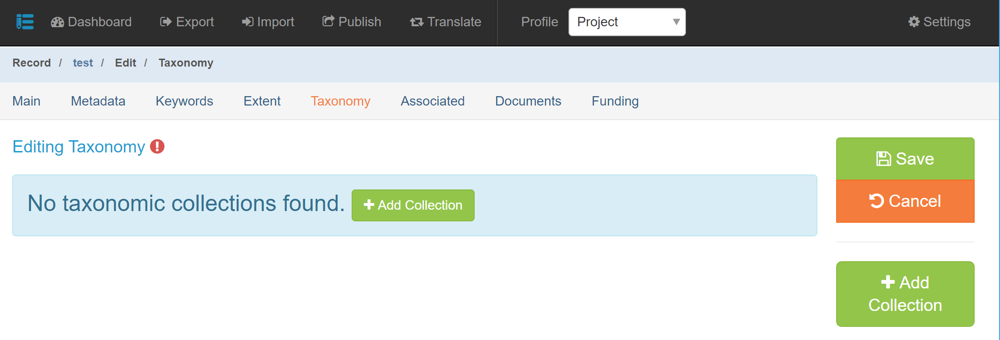

# Project Taxonomy Tab

Taxonomy is required in the cases where a species is the subject of the project or data asset.

## Taxonomy (Required, if applicable)

The mdEditor Taxonomy section automatically pulls in taxonomic information from ITIS ([Integrated Taxonomic Information System](https://www.itis.gov/)).


Please note that this functionality in mdEditor is not intended to explore ITIS. It is a tool to add known taxonomic information to your metadata. If you want to explore ITIS, visit itis.gov to find detailed information.


The minimum requirements for valid taxonomy are a Taxonomic System plus one or more taxonomic classifications.

## When Taxonomy is Needed

Taxonomy is most useful for search is discovery and functions similar to keywords.


If you have existing species names in the keywords section, you do not need to delete them. Taxonomy is entered in a separate section from keywords in mdJSON.


To some extent, this is up to the best judgement of the metadata author. You will know best the connection of the project to a specific species or other taxonomic group. For example, if a bear model was used to rank habitat for a prioritization product, but the final output is not relevant to bears any longer, then you probably do not need to add bear species in taxonomy.

### How to add Taxonomic System

(1) Click "Add Collection"

(2) From here, you can click "Add Taxa from ITIS" (from the right) directly without needing to choose the taxonomic system. This will be filled in for you automatically once you have added items from ITIS.

.png>)

(3) Enter your search terms in the search box. You can type in a common name, scientific name, or TSN (Taxonomic Serial Number) assigned by ITIS. You can type in any level of taxonomy, not just species name (e.g., you can type in an order or class or genus). You can specify by Kingdom, if you like.


If you haven’t used the search in a while (or ever) the ITIS API service might be asleep so it will take more time to load, but it should work more quickly after that.



The status of the taxonomic classification is denoted in parentheses() after the TSN. ITIS may consider a classification "invalid" if the species was reclassified, for example. It is up to you whether you want to add invalid ITIS classifications to your metadata.


(4) Click "Add" for the search results that you would like included in your record and then click "Import Taxa." A message of successful import should appear at the bottom of your screen.


&#x20;mdEditor will not to create duplicate entries of the same taxa if the same species is accidentally imported multiple times.


.PNG>)

5\) Click "Back to Collection." You will see that it has added a taxonomic hierarchy and a Title to Taxonomic System (if you hadn’t already added one by hand). This completes the minimum requirements for taxonomy.


You can click on any level of the taxonomic hierarchy to collapse the entries below that level.


.PNG>)

(6) You can add additional information regarding the taxonomic information, if desired.

**Observers** can be added from your contacts if staff worked in the field or lab to identify species.

**General Scope** is a description of the range of taxa considered in the dataset or collection.

**Identification Procedure** should include a description of the methods used for taxonomic identification.

**Identification Completeness** should detail information regarding completeness and uncertainty of the identifications.

**Voucher** would be filling in with information about specimens you submitted to a museum or a storage facility where specimens are stored.  The museum or storage facility should be entered as a Contact. (See Contact Entry Guidance).

.png>)

.png>)
